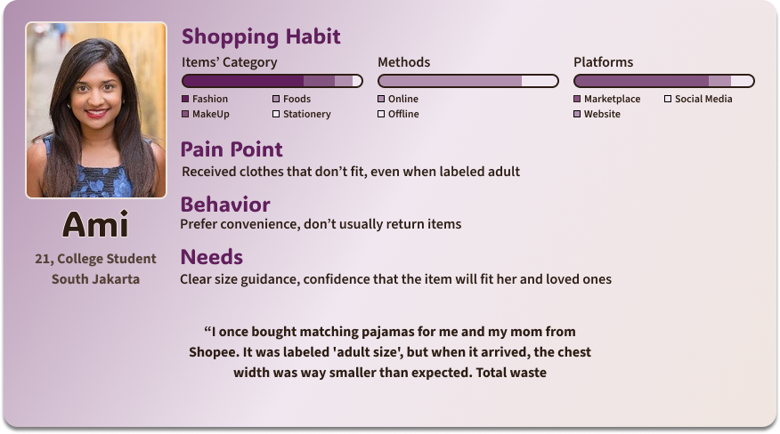
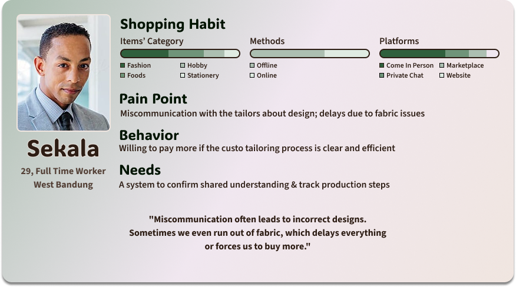
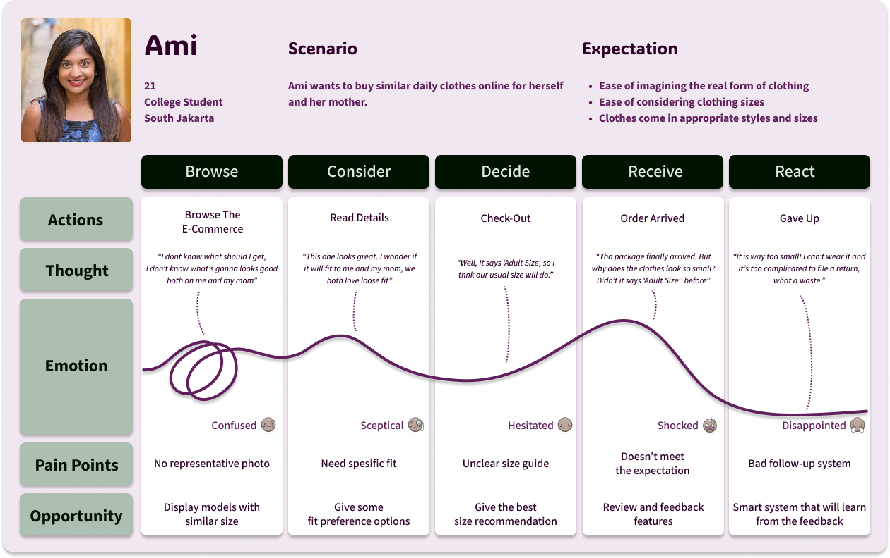
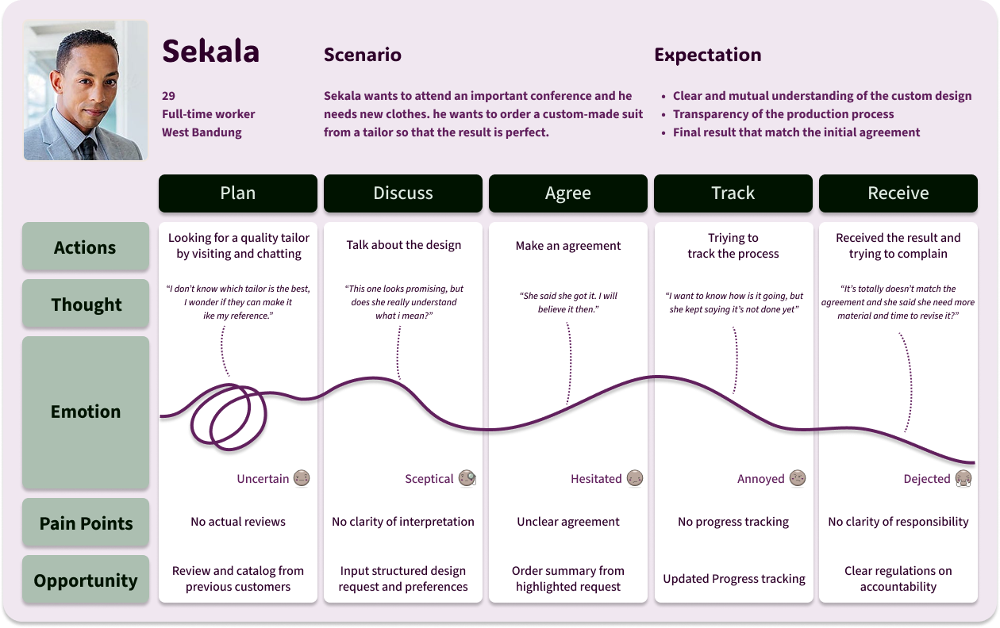

## Background

  Online clothing shopping has become part of the modern lifestyle, particularly among fashion enthusiasts. However, although practical, this process is often accompanied by uncertainty: <strong>"Will the clothes I buy fit my body?"</strong> 

Many online shoppers, including me, also experience similar problems. Some of the clothes I bought could not be worn because they did not match the size and fit expectations. This causes disappointment, discomfort, and even loss because not all items can be exchanged.

On the other hand, buyers who want to place custom orders often experience difficulties because they can generally only be done via private chat, which is prone to miscommunication and inefficiency. This is also a problem for tailors and home fashion entrepreneurs who often receive custom orders.

The initial inspiration for this project came from a scene in a drama, where VIP customers do not need to try on clothes one by one, because a model with a similar body has been provided to demonstrate the clothes they are interested in. This idea highlights the value of a personally relevant visual experience and the ability to choose the right fit in the clothing selection process.

## User Survey Overview

To better understand user pain points and expectations regarding online fashion shopping and custom tailoring, a survey was conducted, yielding 119 valid responses. The findings reveal significant issues in sizing accuracy, communication, and order transparency — all of which directly inform the development of features in FitYa. These are the key insights found: 

### Sizing issues are highly common in online shopping
- 96.36% of respondents have experienced receiving clothes that didn’t fit.
- 47.90% leave the item unused, while only 21.85% attempt returns.
- Main causes: unclear product descriptions and misleading photos.

### Miscommunication is the biggest pain point in custom orders
- Many users report that custom pieces often don’t match the agreed-upon design.
- Issues like incomplete fabric or design errors cause delays and dissatisfaction.

### Lack of transparency in order progress causes uncertainty
- Time estimates and updates are often unclear, especially in custom orders.
- This leads to user anxiety and loss of trust in the tailoring process.

### Users are excited about personalized shopping solutions
- 93.27% are interested in using FitYa’s custom tailoring and virtual fitting features.
- Most users consider size recommendations and visual references to be the most helpful tools.
- A small percentage expressed concern about data privacy, especially regarding body measurements.

## User Persona
</img>
</img>

Two user personas were created to represent two types of clothing buyers. <strong>Ami</strong> represents users who frequently shop for fashion items online but often struggle with sizing accuracy. She prefers convenience, rarely returns items, and needs clear visual guidance to ensure the clothes will fit — especially when buying for herself and loved ones. Meanwhile, <Strong>Sekala</Strong> represents users who occasionally order custom-made clothing through private channels or direct visits. His main pain point is miscommunication, which leads to incorrect designs and delays. He values clarity, agreement, and real-time progress updates.

## User Journey Map
</img>

  Ami's journey highlights the struggles of buying clothes online without reliable size guidance. Her experience reveals common pain points such as unclear size charts, lack of model references, and the hassle of returning ill-fitting items. These issues result in disappointment and wasted purchases, underscoring the need for smarter, more personalized online fashion tools.

</img>

  Sekala’s journey uncovers the challenges faced when ordering custom-made clothing from local tailors. From unclear communication about design preferences to lack of progress transparency, his experience reflects how misaligned expectations can lead to frustration and unmet results. His story shows the importance of structured requests, tracking systems, and mutual clarity in custom services.

## Key Solutions

This application aims to provide a more personal, accurate, and flexible online fashion shopping experience. With the following main features:

### Virtual Try-On Avatar

The storefront displays clothes directly on a virtual model based on the user's body measurements. Users can save their body measurements just like how they save their address. Users' privacy will be prioritized through explicit consent, data control options, and transparent policies.

### Fit Preference

The system considers user preferences (such as tighter or looser) in recommending the best size. Users can also save their preferences along with their body measurements.

### Custom Tailoring Section

Shoppers can order custom clothes directly from tailors within the application, from viewing model examples to requesting special sizes and agreeing on prices. They can also easily track their order progress.

