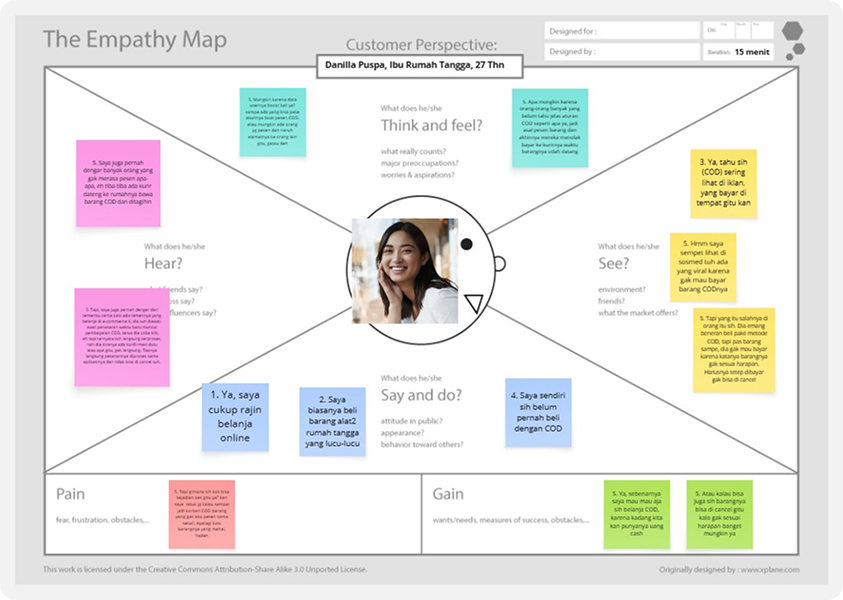
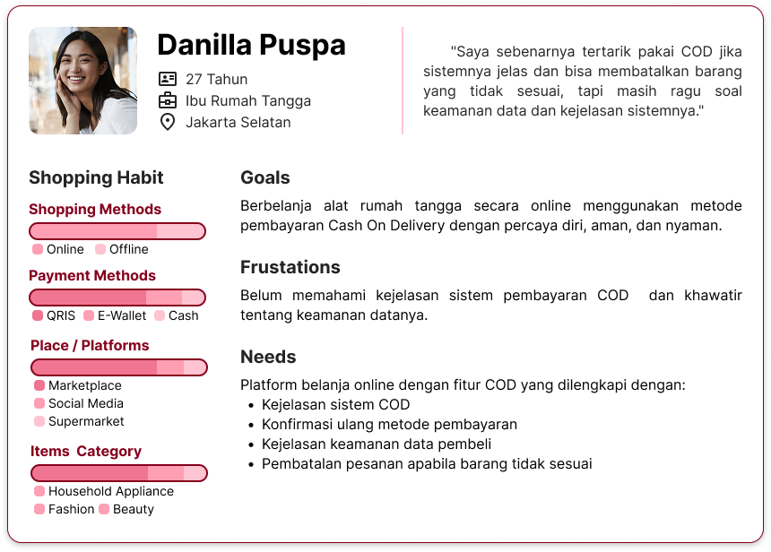
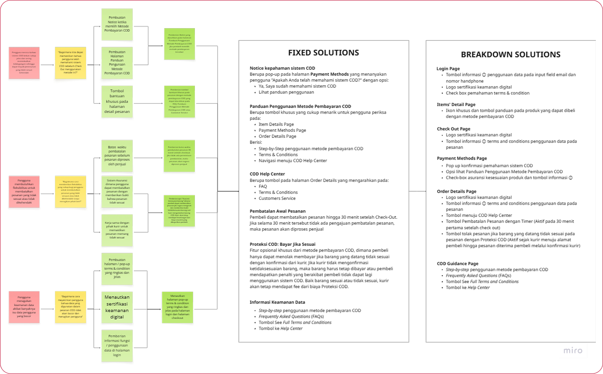
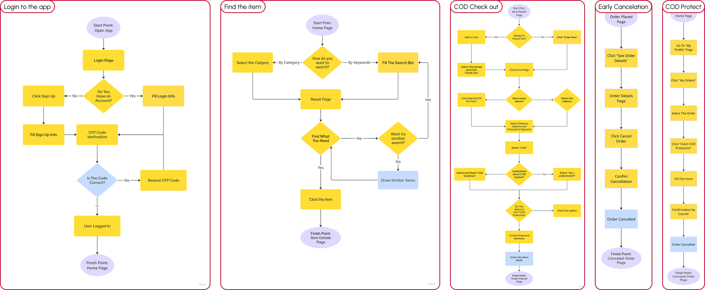
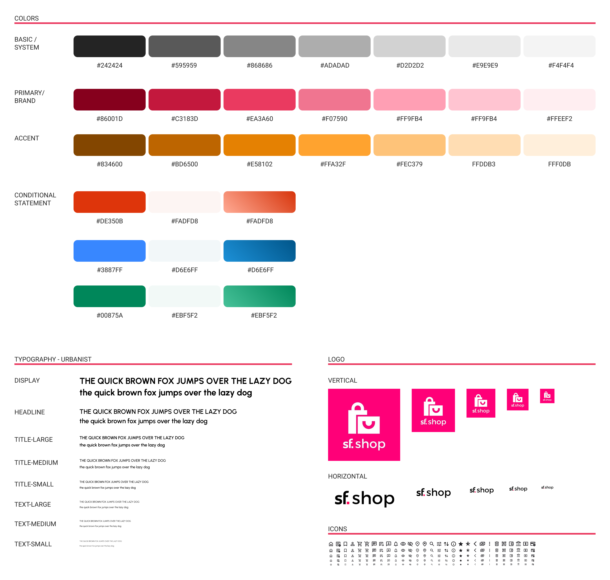

## About This Project
### Background
This case study is the final task of the Project-Based Internship in collaboration between PT Nuri Gaya Citra and Rakamin Academy. The project was designed to sharpen UI/UX design and analysis skills by addressing real user problems found on the sf.shop platform, specifically related to the Cash on Delivery (COD) payment feature.
### Objectives
- Identify and resolve user issues with the COD feature, including information, interactions, and service expectations.
- Encourage broader adoption of COD as a reliable and trusted payment method, especially for users with limited access to digital payments.
- Create a seamless, intuitive, and stress-free shopping experience for users from various digital literacy levels.
### My Role
UI-UX Designer
### Tools
Miro, Figma, Maze
### Duration
10 Days (July 21-30, 2025)

## Research Summary
### Objectives
The research was conducted to explore insights and problems experienced by users when shopping online using Cash on Delivery (COD).
### Methods
The research was conducted using the In-Depth Interview method with 5 respondents who matched the following criteria:
- Aged between 18-45 years
- Have experience with online shopping
### Key Findings
- Most respondents shop online regularly and across a variety of product categories.
- All respondents are already aware of the COD payment method, with most of them learning about it from social media ads.
- Despite the awareness, most respondents have never used COD in their transactions.
- They are interested in using COD in certain situations — such as when only having cash or when wanting the option to cancel if the product doesn’t match expectations.
- However, many rumors and negative stories make users hesitant, such as receiving unexpected COD packages due to data leakage and inability to cancel a COD order because there is no final confirmation step
- These problems are assumed to be caused by a lack of data security and limited user understanding of how the COD system works.

## Meet the User 
### Empathy Map

In this stage, an empathy map is used to understand the user’s behaviors, thoughts, feelings, and environment — including what they say, do, think, and hear.
### User Persona

Based on the insights from the empathy map, user personas are created to represent the user's profile, shopping habits, goals, needs, and frustrations. This helps in building a clear, human-centered design foundation.

## Understanding the Challenges
### Unclear COD System
Users find the Cash on Delivery (COD) system unclear and sometimes confusing, which may lead to unexpected or incorrect orders.
<q>How might we ensure that users clearly understand how the COD system works before they use it?</q>
### Order Cancelation System
Users need the flexibility to cancel orders that are incorrect or unwanted.
<q>How might we provide users with enough flexibility to cancel such orders without harming other parties involved?</q>
### User Data Security
Users are concerned about data security due to frequent issues of data leaks.
<q>How might we assure users that their personal information used in COD orders is secure and won’t be misused?</q>

## Bringing Out the Right Solutions
### Exploring possibilities

Based on the identified problem statements, several alternative solutions were explored, then refined and combined to form the best possible approach.
This project focuses on improving **clarity of information** and **precise navigation placement** to support features related to:
- The COD payment system and COD Protection
- User data security policies
A breakdown of the related features and screens has also been created and can be seen in the picture.
 
### Creating Flows

To illustrate a complete user experience, five key user flows were developed, covering the following scenarios:
- Logging into the app
- Browsing and finding a product
- Checking out using COD and COD Protection
- Canceling an order before it is processed (early cancellation)
- Canceling an order upon delivery using COD Protection

## Building the Experience
### Wireframes

20 wireframes were then made based on the steps stated in the user flows.

### Design Kit

Here's a preview of the design kit that was created based on the application's identity. Here's a preview of the design kit.
