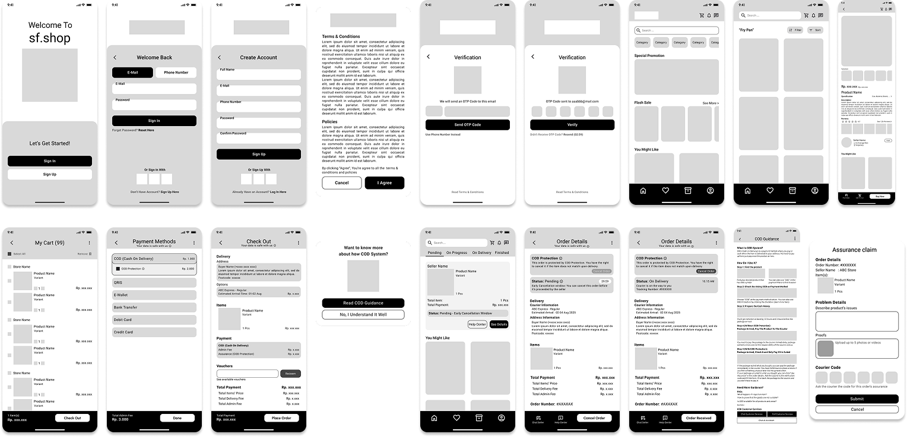

## About This Project
### Background
This case study is the final task of the Project-Based Internship in collaboration between PT Nuri Gaya Citra and Rakamin Academy. The project was designed to sharpen UI/UX design and analysis skills by addressing real user problems found on the sf.shop platform, specifically related to the Cash on Delivery (COD) payment feature.
### Objectives
- Identify and resolve user issues with the COD feature, including information, interactions, and service expectations.
- Encourage broader adoption of COD as a reliable and trusted payment method, especially for users with limited access to digital payments.
- Create a seamless, intuitive, and stress-free shopping experience for users from various digital literacy levels.

### My Role
UI-UX Designer
### Tools
Miro, Figma, Maze
### Duration
10 Days (July 21-30, 2025)

## Research Summary
### Objectives
The research was conducted to explore insights and problems experienced by users when shopping online using Cash on Delivery (COD).
### Methods
The research was conducted using the In-Depth Interview method with 5 respondents who matched the following criteria:
- Aged between 18-45 years
- Have experience with online shopping
### Key Findings
- Most respondents shop online regularly and across a variety of product categories.
- All respondents are already aware of the COD payment method, with most of them learning about it from social media ads.
- Despite the awareness, most respondents have never used COD in their transactions.
- They are interested in using COD in certain situations — such as when only having cash or when wanting the option to cancel if the product doesn’t match expectations.
- However, many rumors and negative stories make users hesitant, such as receiving unexpected COD packages due to data leakage and inability to cancel a COD order because there is no final confirmation step
- These problems are assumed to be caused by a lack of data security and limited user understanding of how the COD system works.

## Meet the User 
### Empathy Map

In this stage, an empathy map is used to understand the user’s behaviors, thoughts, feelings, and environment — including what they say, do, think, and hear.
### User Persona

Based on the insights from the empathy map, user personas are created to represent the user's profile, shopping habits, goals, needs, and frustrations. This helps in building a clear, human-centered design foundation.

## Understanding the Challenges
### Unclear COD System
Users find the Cash on Delivery (COD) system unclear and sometimes confusing, which may lead to unexpected or incorrect orders.
<q>How might we ensure that users clearly understand how the COD system works before they use it?</q>
### Order Cancelation System
Users need the flexibility to cancel orders that are incorrect or unwanted.
<q>How might we provide users with enough flexibility to cancel such orders without harming other parties involved?</q>
### User Data Security
Users are concerned about data security due to frequent issues of data leaks.
<q>How might we assure users that their personal information used in COD orders is secure and won’t be misused?</q>

## Bringing Out the Right Solutions

### Exploring possibilities

Based on the identified problem statements, several alternative solutions were explored, then refined and combined to form the best possible approach.
This project focuses on improving **clarity of information** and **precise navigation placement** to support features related to:
- The COD payment system and COD Protection
- User data security policies
A breakdown of the related features and screens has also been created and can be seen in the picture.

### Creating Flows

To illustrate a complete user experience, five key user flows were developed, covering the following scenarios:
- Logging into the app
- Browsing and finding a product
- Checking out using COD and COD Protection
- Canceling an order before it is processed (early cancellation)
- Canceling an order upon delivery using COD Protection 

## Building the Experience
### Wireframes

20 wireframes were then made based on the steps stated in the user flows.

### Design Kit

Here's a preview of the design kit that was created based on the application's identity. Here's a preview of the design kit.

### Prototype
Using the design kit, the resulting prototype is shown below. You can also explore this prototype at <a href="http://bit.ly/3Uy1rY3" target="_blank">this link</a>.
- Flow 1: Logging into the app
  
- Flow 2: Browsing and finding a product
  
- Flow 3: Checking out using COD and COD Protection
  
- Flow 4: Canceling an order before it is processed (early cancellation)
  
- Flow 5: Canceling an order upon delivery using COD Protection
  

## Putting it to the test
At this stage, usability testing was conducted with four participants through Maze. The prototype achieved a 100% success rate. However, due to the limited time available, the UT was only conducted unmoderated, so direct feedback from participants was not obtained. You can see the results below. You can also try it by yourself by clicking <a href="https://t.maze.co/423604674" target="_blank">this link.</a>
- Flow 1: Logging into the app
  
- Flow 2: Browsing and finding a product
  
- Flow 3: Checking out using COD and COD Protection
  
- Flow 4: Canceling an order before it is processed (early cancellation)
  
- Flow 5: Canceling an order upon delivery using COD Protection
  

## Highlighted Outputs
### COD System Awareness Confirmation

A confirmation step that ensures users understand how the COD system works before choosing it. It links directly to detailed COD guidance for those who want to learn more.

### COD Guidance Page

A centralized page containing everything users need to know about COD:
- Overview of the system
- Step-by-step usage instructions
- Frequently Asked Questions (FAQs)
- Access to Help Center
Accessible via product pages and the payment method screen.

### Early Cancellation

A 30-minute window after checkout allows users to cancel their order before the seller processes it.
- Prevents accidental purchases
- Reduces failed COD deliveries
- Protects sellers from unnecessary preparation

### COD Protection

An optional feature that builds trust and fairness in COD transactions:
- Buyers can inspect the item on delivery before payment
- Orders can be rejected if the item is incorrect or damaged
- Couriers are still compensated
- All transactions are securely documented

## Summary
This project focused on understanding user behavior and addressing the challenges they face when using the COD payment method on the sf.shop platform. The findings revealed that lack of clarity in the COD process and concerns about data security were the main issues. Solutions were designed to improve information transparency, clarify order cancellation flows, and create a safer, more reassuring shopping experience.
This project was more than just a UI design exercise. It was a reflection on how thoughtful design can bridge the gap between user needs and complex systems. Hopefully, this redesign can inspire further development toward a more inclusive and trustworthy digital shopping experience.
