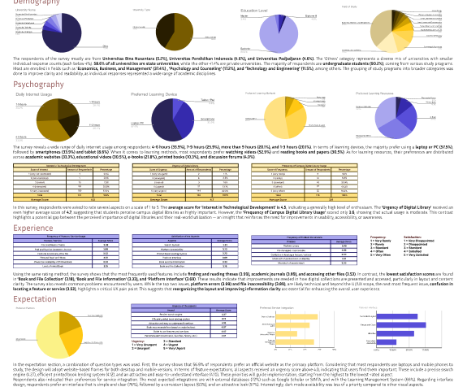

## Background
Digital platforms are a primary need for students in their learning activities. Academic books and articles need to be accessible anytime, anywhere. Physical book lending systems should also be manageable online. **While some universities have introduced digital libraries, most of them still have poor usability and outdated interface As**. a result, many students are unaware of or do not fully understand the benefits of digital libraries. According to the Higher Education Database (PDDikti), there were 9.32 million active students in Indonesia in 2025, yet only around 1.5 million have used their campus digital library. **This indicates a gap between the demand for and the use of digital technology, especially digital library, in academic environments.** 

## Objectives
- **Identify usability issues** — Evaluate interface pain points from user interviews and heuristic analysis.
- **Understand student behavior** — Analyze how students currently interact with digital library tools.
- **Design improved UI** — Create wireframes and UI concepts focused on accessibility and simplicity.
- **Prototype & test** — Validate design through usability testing and iteration.

## My Role
This is my **first solo project**. I took on the whole role **from research planningto interface design**.

## Timeline
- **Project planning** — June 1, 2025
- **Research planning** — June 2, 2025
- **User & Desk Research** — June 3-9, 2025
- **Quantitative & Competitive analysis** — June 10-12, 2025
- **User Persona & Journey Map** - June 13-15, 2025
- **Wireframe & Prototype** — June 16-25, 2025
- **Validation & Feedback** — June 26-28, 2025
- **Final Result** — June 29-30, 2025

## Research Methods
  This project employs a **mixed-method approach** that combines **quantitative user research (survey) and dessk research (competitive analysis)**  to explore and improve the user experience of campus digital library platforms in Indonesia.
### User Research (Survey)
A quantitative survey was conducted to gather insights from Indonesian university students who have used campus digital libraries. It explored user demographics, behavior, perceptions, and expectations. **The survey was distributed online via social media using convenience sampling with a minimum target of 164 respondents (Slovin, confidence level 80%, margin of error 5%)**.
### Desk Research (Competitive analysis)
To complement the user insights, a comparative review of four selected university digital library platforms was conducted: **BINUS University, Universitas Pendidikan Indonesia (UPI), Universitas Indonesia (UI), and Universitas Terbuka (UT)**. These platforms were selected based on a combination of user representation in the survey and their prominence in digital library implementation.

## Findings & Insights
### User Research (Survey)

As it shown in the picture, this survey revealed extensive data. Among the many findings gathered through the survey, these are the key insights that guided the design direction:

- **Demographic & Psychographic:** Most respondents are undergraduate students who frequently access academic materials through both desktop and mobile devices. They are goal-oriented and highly value quick and flexible access to relevant references.
- **User Experience:** Users primarily use the platform to read theses and journals, but often experience confusion due to outdated and inconsistent interfaces. The search function is widely used, yet the satisfaction level remains average due to unclear filtering and navigation systems. Many users feel overwhelmed by poor layout structure and lack of visual guidance.
- **User Expectations:** There is a strong demand for intuitive navigation, responsive design, and integration with external platforms like Google Scholar and LMS. Users expect a modern digital library with precise search, clear information structure, and ease of access across devices.

### Desk Research (Competitive analysis)

## User Persona

## User Flows

## Wireframe

## Prototype

## Validation & Feedbacks
---

Thank you

