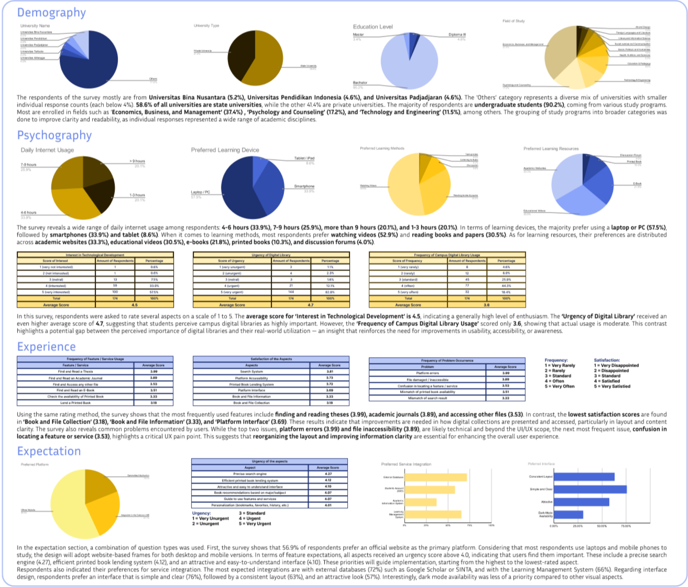
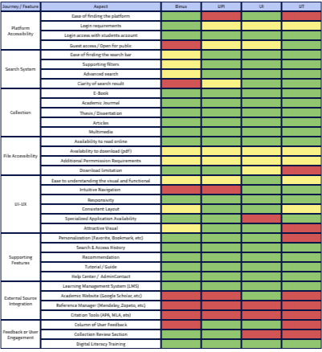

## Background

  Digital platforms are a primary need for students in their learning activities. Academic books and articles must be readily accessible anytime and anywhere. While some universities have introduced digital libraries, most of them still have poor usability and outdated interfaces. As a result, many students are unaware of or do not fully understand the benefits of digital libraries. According to the Indonesian Higher Education Database (PDDikti), there were 9.32 million active students in Indonesia in 2025. However, only around 1.5 million have used their campus digital library. <strong>This indicates a gap between the demand for and the actual use of digital libraries in academic environments.</strong>

## Objectives
-	**Understand student behavior** — Analyze how students interact with digital libraries.
-	**Identify usability issues** — Evaluate interface pain points from the user research.
-	**Design improved UI** — Create wireframes and UI concepts based on students’ needs
-	**Prototype & validation** — Validate design through usability testing and iteration.

## My Role
This is my first solo project. I took on the whole role from research planning to interface design.

## Timeline
- **Planning & preparation** — June 1-2, 2025
- **Research** — June 3-9, 2025
- **Analysis & Synthesis** — June 10, 2025
- **User Persona** — June 11, 2025
- **User Flow & Low-Fi Wireframe** — Jun 12, 2025
- **Mid-Fi Prototype** — June 13-19, 2025
- **Validation & Feedback** — June 20-22, 2025
- **Hi-Fi Prototype** — June 23-29, 2025
- **Publication** — June 30, 2025

## Research
  This project employs a **mixed-method approach** that combines **quantitative user research (survey) and dessk research (competitive analysis)**.
### User Research (Survey)

  A quantitative survey was conducted to gather insights from Indonesian university students who have used campus digital libraries. 174 valid responses were analyzed from a total of 227 collected during a 7-day survey period. After data cleaning, the final sample meets an estimated 80% confidence level, which is sufficient for generating actionable UX insights. Among the many findings gathered through the survey, these are the key insights that guided the design direction:

  - <strong>Demographic & Psychographic:</strong> Most respondents are undergraduate students who frequently access academic materials through both desktop and mobile devices. They are goal-oriented and highly value quick and flexible access to relevant references.

  - <strong>User Experience:</strong> Users primarily use the platform to read theses and journals, but often experience confusion due to outdated and inconsistent interfaces. The search function is widely used, yet the satisfaction level remains average due to unclear filtering and navigation systems.

  - <strong>User Expectations:</strong> There’s a strong demand for a modern digital library with precise search capabilities, a clear information structure, and ease of access to learning resources, including external resources such as LMS and Google Scholar.

### Desk Research (Competitive analysis)

  To complement the user insights, a comparative review of four selected university digital library platforms was conducted: <strong>BINUS University, Universitas Pendidikan Indonesia (UPI), Universitas Indonesia (UI), and Universitas Terbuka (UT)</strong>. These platforms were selected based on a combination of user representation in the survey and their prominence in digital library implementation.

  Most platforms have already established basic functionalities such as login access, journal collections, and search filters. However, inconsistencies persist in terms of user accessibility, UI clarity, and supporting features, including personalization, citation tools, and visual design. Moreover, considering that many survey respondents indicated academic websites and learning videos as their preferred learning resources, integration with tools like Google Scholar and LMS platforms could offer a strategic advantage. <strong>These findings highlight opportunities for improvement by focusing on clearer interfaces, more intuitive search experiences, broader public accessibility, and stronger academic tool integration.</strong>

## User Persona

  Two key user personas were developed to represent the primary users of the digital library platform and the existing gaps in current digital libraries. <strong>Amelia</strong> represents users who prioritize efficient search and access to academic resources but often feel overwhelmed by outdated interfaces and poorly organized information systems. Meanwhile, <strong>Raka</strong> reflects users who are more tech-savvy but frustrated by the clunky design and lack of learning resources. 

  

  <strong>UNIVIA</strong>UNIVIA is a fictional university that was created to represent Indonesian universities, as this project was based on the experiences of Indonesian university students. The logo was made to make this university even more realistic. These three colors were chosen to create a professional (blue), vibrant and attractive (yellow), while remaining balanced and elegant (grey) identity.

## Ideation

  Both user personas served as the foundation for the ideation process. As a result, the design priorities were identified as follows: <strong>Ensuring a consistent and easy-to-learn layout, providing extensive and diverse learning resources, and presenting content with a clear hierarchy and well-organized information structure</strong>. To achieve this goal, three main functions will be created, including: <strong>(1) online and offline access to digital collections, (2) printed collection reservations, and (3) access to external integrated resources.</strong>

## User Flows

  Three user Flows were developed to visualize the key activities users may perform in the digital library, including browsing and accessing digital collections, making printed collection reservations, and exploring external academic resources. These flows helped identify potential pain points and ensure a smooth user experience.

## Wireframe

  Low-fidelity wireframes were created with a focus on the functionality of each step identified in the user flows. At this stage, the primary emphasis was placed on content structure and clarity of navigation.

## Mid-Fi Prototype

  I use this mid-fidelity prototype, which has most key functions already active, for the initial validation. The design adopts UNIVIA’s logo colors and shapes to reflect the university’s identity. The homepage allows students to explore academic resources easily. Features like “Last Seen,” “For You,” and “Popular” are designed to support quick access and personalized discovery. “Just In” promotes newly added collections.
A standout feature is the printed collection reservation system, which caters to students with tight schedules. The form is designed to be simple for ease of use. Advanced filters and external resources enhance the search experience, directing users to reliable sources. At the bottom of each page, a “Browse More” section encourages continued exploration. <strong>Overall, the prototype emphasizes efficiency and relevance in accessing learning materials.</strong>

## Validation & Feedbacks

  To validate the design, I conducted one direct usability testing session and distributed an online validation form to additional participants. The validation focused on key user flows, including exploring digital collections, reserving printed materials, and accessing external resources. Feedback was collected on visual clarity, ease of navigation, and the usefulness of features. Although there are numerous positive responses, several complaints have been received. <strong>These insights gathered helped identify areas for improvement, such as simplifying the interface, refining content hierarchy, and enhancing the clarity of information cards.</strong>

## Hi-Fi Prototype

The high-fidelity prototype was developed based on the insights gained from the design validation process. Aesthetic elements were simplified, replacing decorative visuals with clean and intuitive icons. The information cards for each collection have been redesigned to appear more structured and informative. The advanced filter feature was also refined, now allowing users to select 1 to 3 filter criteria more efficiently. Additional unresolved details from the earlier prototype have also been addressed. For instance, the reservation form now includes a proper date selector, ensuring the form is functionally complete and easier to understand.
The most significant transformation occurred on the Reservation Details page. Previously, this page was located under the 'Reservations' section, but it lacked a clear hierarchy and placement. In the current design, the Reservations section is now clearly situated under 'My Account', displaying categorized reservation history—To Pick-Up, To Return, Completed, and Canceled.

## Conclusion

  This project examines how digital libraries can enhance their service to students by improving accessibility, clarity, and efficiency in locating learning resources. Through user research, competitive analysis, and usability testing, I identified key pain points and expectations that guided the design of a digital library platform, one that is not only functional but also intuitive and visually cohesive.
From low- to high-fidelity prototypes, the design evolved to prioritize clear structure and practical features, including printed collection reservation, personalized recommendations, and integration with external academic resources. Usability testing provided valuable feedback that shaped the final design to support students’ educational journeys better, making it more efficient, clear, and accessible.

  This is my first UI/UX project, and I took on the entire process—from research planning to prototyping—within just one month. While the design and prototype are still far from perfect, I recognize there is much room for growth and improvement. I plan to revisit and refine this work in the future, incorporating deeper insights and evolving user needs. Therefore, I genuinely welcome any feedback, suggestions, or constructive criticism to help elevate both the user experience and design quality. You can view the prototype <a href="https://www.figma.com/proto/ds8K25mkbTMV8J01zQ8QPw/Students---Digital-Libraries--From-Insight-to-Interface?node-id=571-31840&p=f&t=qmD1bvb4gJJdegc3-1&scaling=scale-down-width&content-scaling=fixed&page-id=571%3A29597" target="_blank"> here</a> and contact me via <a href="https://www.linkedin.com/in/shabrina-m-654b7b194" target="_blank."> linkedin</a> 

---

Thank you

